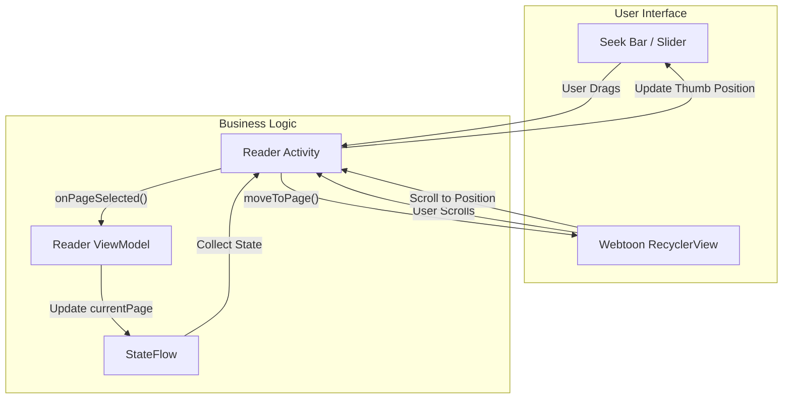
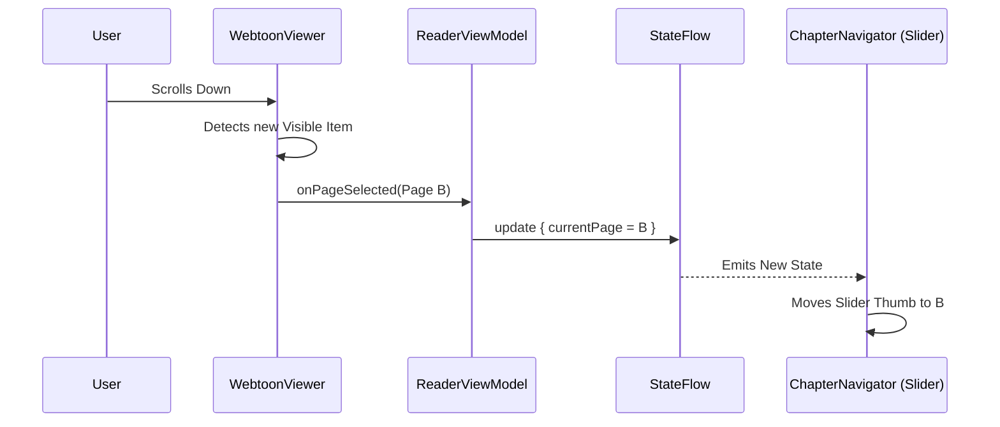
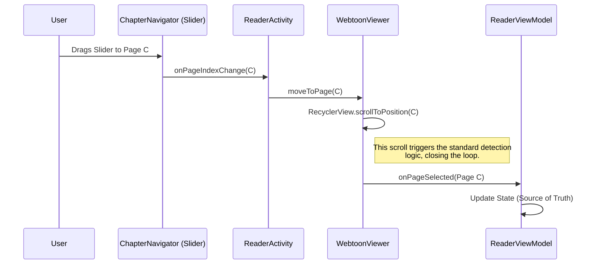

# Mihon State Synchronization

This document explains the synchronization between the user interface (Seek Bar) and the internal reader state (Chapter/Page progress).

## 1. The Synchronization Loop

Mihon employs a **Unidirectional Data Flow** pattern where the `ReaderViewModel` acts as the single source of truth. However, since the user can interact with both the Scroll View (reading) and the Slider (seeking), the flow has two entry points that converge on the same state update loop.

### Flow Diagram

## 2. Detailed Sequences

### Scenario A: User Reads (Scrolling)

This is the passive update loop. As the user consumes content, the UI updates to reflect progress.

### Scenario B: User Seeks (Sliding)

This is the active command loop. The user forces a state change via the UI.

## 3. Conflict Resolution

To prevent jitters or conflicts (e.g., the slider trying to update while the user is still dragging it), the system relies on:

1.  **Single Source of Truth**: The slider does not maintain its own offset state; it always reads from the `ViewModel` state.
2.  **Smooth Scrolling**: When seeking, `WebtoonViewer` typically uses `scrollToPositionWithOffset` (instant jump) rather than smooth scrolling for long distances, which prevents intermediate `onPageSelected` events from firing wildly during the seek.
3.  **Haptic Feedback**: Provided during the drag to give physical confirmation of the "tick" (page change) before the visual jump occurs.
